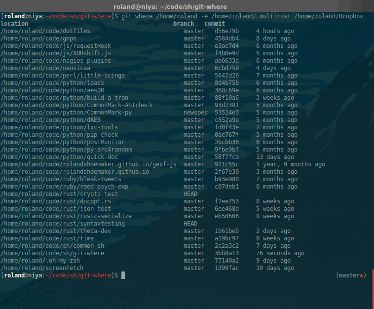

# `git where` - where are my repositories at...

A super duper simple git sub command that helps you find where you put those repositories.

## Usage

)

	$ git where
	git where <search_path> [-e <exclude_path>...]

	options:
	    -e <exlucde_path>...        Exclude single or multiple pathes from
	                                the search.

